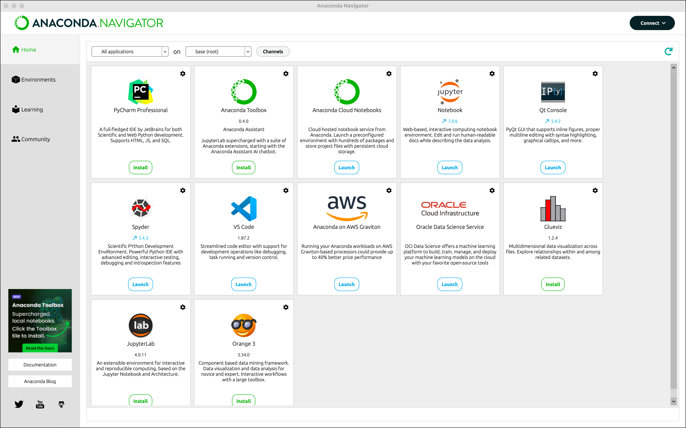

# Local setup for phi-3 finetuning notebook

## Step 1: Installing Anaconda navigator


[**Download using this link**](https://www.anaconda.com/download/success)

## Step 2: Launching jupyter notebook



## Step 3: Cloning this repository

```
git clone https://github.com/yashdkadam/Raykor.git
```
## Step 4: Find file from file jupyter file explorer


## Step 5: Running the whole notebook using 'Restart kernel and run all'


